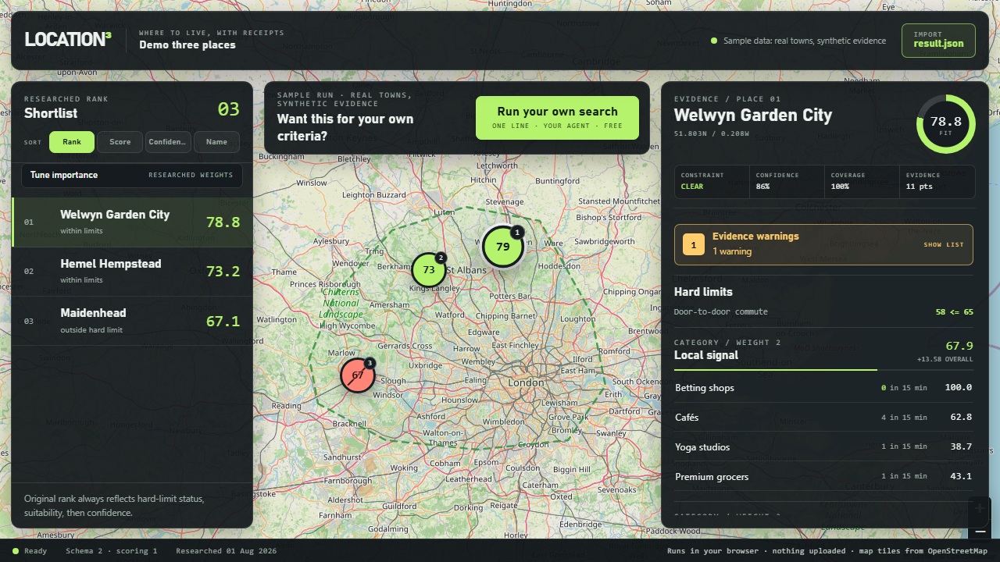
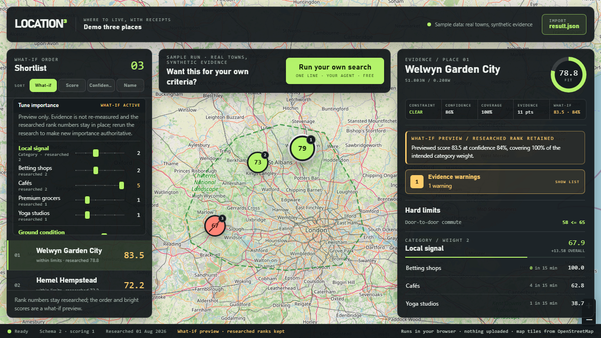
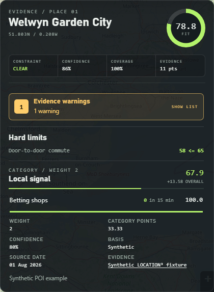
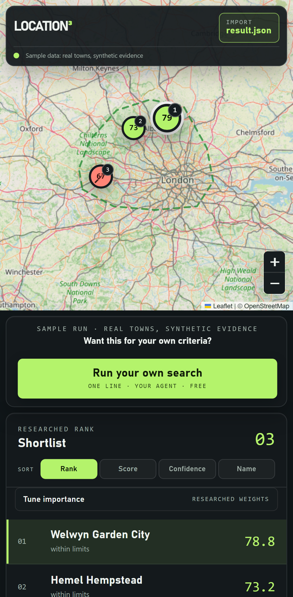

```text
 ██╗      ██████╗  ██████╗ █████╗ ████████╗██╗ ██████╗ ███╗   ██╗ ³
 ██║     ██╔═══██╗██╔════╝██╔══██╗╚══██╔══╝██║██╔═══██╗████╗  ██║
 ██║     ██║   ██║██║     ███████║   ██║   ██║██║   ██║██╔██╗ ██║
 ██║     ██║   ██║██║     ██╔══██║   ██║   ██║██║   ██║██║╚██╗██║
 ███████╗╚██████╔╝╚██████╗██║  ██║   ██║   ██║╚██████╔╝██║ ╚████║
 ╚══════╝ ╚═════╝  ╚═════╝╚═╝  ╚═╝   ╚═╝   ╚═╝ ╚═════╝ ╚═╝  ╚═══╝
 WHERE TO LIVE, WITH RECEIPTS
```

**LOCATION³** is a local, user-run tool for deciding *where* to live before
deciding *which home*. You give it an approximate origin, a travel-time limit,
your destinations, a housing budget, and the things that make everyday life good
for you. It researches only the places inside that boundary, records where every
fact came from, scores them deterministically, and shows the trade-offs on a map.

It is a decision-support tool, not an oracle. Every score explains itself, every
fact carries a citation and a confidence, and missing evidence is shown as
missing rather than averaged away.



## Why it exists

Property portals answer "which homes are advertised right now?" They are poor at
"where would my life work?" Their filters stop at price, bedrooms, and a circle
on a map. They do not combine a realistic door-to-door commute, a fifteen-minute
walk to a café, the nearest green space, how well the streets are kept, or how
much a bookmaker on every corner bothers you.

LOCATION³ recommends *areas* first. It narrows a commuter region to a defensible
shortlist, explains why each place scored what it did, and then hands you off to
an external listing search for the homes themselves. It never scrapes portals
and never claims a property exists because an area looks affordable.

## How a run works

1. **Preview.** `research_location.py` prints exactly what will leave your
   machine: the rounded origin sent to the routing provider, the boundary polygon
   and brand patterns sent to Overpass, the metrics measured and skipped, and the
   call ceiling.
   Nothing is fetched until you add `--execute`.
2. **Bound.** One OpenRouteService isochrone becomes the search envelope, for
   example everywhere within a 30-minute drive. Without a routing key a
   labelled straight-line distance proxy stands in, so a first run needs no
   signup.
3. **Collect.** One combined Overpass call discovers cities, towns, suburbs,
   villages, and neighbourhoods inside the envelope and, around each of them,
   fetches only the amenity metrics you weighted or limited (cafés, betting
   shops, yoga, configurable premium grocers, public green space) plus the
   walkable street network. Two live calls, total, with an expiring local cache
   so a rerun costs nothing.
4. **Measure.** Deterministic Python counts amenities within a 15-minute walk
   along the mapped pedestrian network, measures green-space distance, and
   records each observation with its source, licence, retrieval date,
   transformation, and confidence. Observations say when a straight-line proxy
   had to stand in.
5. **Enrich the shortlist.** Cited rail journeys, housing market evidence, and
   street-care evidence are imported as separate zero-network steps, each with
   its own preview and schema.
6. **Score.** Documented curves map each observation to 0–100, categories are
   weighted means, and the overall score is a weighted mean of categories. Hard
   limits are evaluated first. Confidence is reported separately.
7. **Explore.** The viewer draws the boundary and pins, ranks the shortlist,
   opens the evidence for each place, and lets you preview what-if importance
   without touching the researched result.

## The viewer

| Part | What it tells you |
| --- | --- |
| **Map** | Route envelope, numbered score pins, the selected place. OpenStreetMap basemap with visible attribution. |
| **Shortlist** | Researched rank, hard-limit status (clear, unverified, or breached), measured share when a weighted category has no evidence, score. Sort by recommendation, suitability, confidence, or name without changing rank numbers. |
| **Tune importance** | Sliders that preview a what-if order using the scorer's own arithmetic. Bright amber scores and the footer say a preview is active; researched ranks stay put. |
| **Evidence** | Overall fit, confidence, coverage, hard limits, playful readouts, unmeasured categories, route assumptions, rail intelligence, housing affordability, street care, and every metric's raw value, curve score, weight, contribution, confidence, basis, source, and date. |
| **Playful readouts** | Sourdough-to-Slots, Emergency Croissant Radius, Green Escape, Last Train Home, Rail Roulette, Pavement Pride. Restatements of cited evidence that add nothing to the score and say "no evidence" when there is none. |
| **Status rail** | Schema and scoring versions, research date, and the privacy line: runs in your browser, nothing uploaded, map tiles from OpenStreetMap. |





## Metric glossary

Weights are 0–5 defaults in `preferences.toml`, overridable per run. A weight of
0 makes a metric informational. Any metric can also carry a hard limit.

| Metric | Category | Observation | Curve |
| --- | --- | --- | --- |
| Door-to-door commute | Core fit | Minutes including station access, waiting, rail, changes, and the London last mile | Piecewise: 20 min → 100, 45 → 75, 75 → 40, 120 → 0 |
| Housing affordability | Core fit | Typical cost ÷ budget, from cited sold-price or rent evidence | Piecewise: 0.65 → 100, 0.85 → 85, 1.0 → 60, 1.2 → 20, 1.5 → 0 |
| Street care | Ground condition | Cautious 0–100 proxy from fly-tipping, report resolution, and a recent visit audit | Identity |
| Green-space access | Ground condition | Walking minutes to the nearest public park, common, or recreation ground | Piecewise: 0 → 100, 5 → 95, 15 → 70, 30 → 25, 45 → 0 |
| Betting shops | Local signal | Count within a 15-minute walk | Log saturation at 5, reversed |
| Cafés | Local signal | Count within a 15-minute walk | Log saturation at 12 |
| Yoga studios | Local signal | Count within a 15-minute walk | Log saturation at 5 |
| Premium grocers | Local signal | Count of configured brands within a 15-minute walk | Log saturation at 4 |

Categories are balanced by their own weights so several amenity counts cannot
outvote commute and affordability. Missing metrics are left out of the arithmetic
and lower the separate confidence figure instead of pretending to be average.

## Architecture

| Layer | Responsibility |
| --- | --- |
| `skills/location-research/` | The one research workflow. Codex (`$location-research`) and Claude Code (`/location-research`) entry points are thin pointers to it. |
| `scripts/` and `src/location3/` | Deterministic Python: routing, Overpass, and ORR adapters, walking-network catchments, scoring curves, schema validation, provenance, caching with a request ledger, one preview-first importer skeleton, and export. |
| `schemas/` | Draft 2020-12 contracts for profile, evidence, results, provenance, and the rail, housing, and street-care inputs. Every file is validated before it is written. |
| `app/` | React, TypeScript, Vite, and Leaflet viewer. Reads a `results.json` in the browser tab, validates it, and never uploads it. |
| `fixtures/demo/` | The synthetic demonstration run, regenerated byte-for-byte by `scripts/build_demo.py`. |
| `research-runs/`, `cache/` | Private, gitignored output of your own runs. |

Agents gather and reconcile evidence; code applies the boundary, the catchments,
the hard limits, and the scores. Switching agent cannot change a number. Every imported fact carries a basis of
measured, transformed, agent-inferred, or user-observed, and an agent-inferred
value cannot claim confidence above 0.5.

## Sources and services

| Source | Used for | Terms |
| --- | --- | --- |
| [OpenStreetMap](https://www.openstreetmap.org/copyright) via the [Overpass API](https://overpass-api.de/) | Settlements, amenities, green space, pedestrian network | ODbL 1.0; attribution shown on the map and in every observation |
| [OpenRouteService](https://openrouteservice.org/) | Isochrone search envelope | Free tier with your own key in `ORS_API_KEY`; never stored in a bundle |
| [HM Land Registry Price Paid Data](https://www.gov.uk/government/statistical-data-sets/price-paid-data-downloads) and ONS rents | Cited housing evidence you import | Open Government Licence |
| [Defra fly-tipping statistics](https://www.gov.uk/government/statistics/fly-tipping-statistics-for-england) and [FixMyStreet](https://data.mysociety.org/datasets/fms-geographic/) | Cited street-care evidence you import | As published; treated as a low-resolution prior |
| National Rail timetables | Cited rail journey evidence you import | As published |
| [ORR passenger rail performance](https://dataportal.orr.gov.uk/statistics/performance/passenger-rail-performance/) Tables 3138 and 3124 | Operator punctuality and cancellations, fetched by the bounded ORR adapter (two cached calls) | OGL-3.0 |
| [Leaflet](https://leafletjs.com/) and OpenStreetMap tiles | Map rendering | BSD-2; [tile usage policy](https://operations.osmfoundation.org/policies/tiles/) |

## Running it

### Fastest start

One line clones the repository, installs it, reports what it found, and opens
your coding agent inside it with the research skill loaded. Pick your agent
(`claude` or `codex`) and your shell:

```powershell
$env:LOCATION3_AGENT = "claude"; irm https://raw.githubusercontent.com/lukexyz/location-location-location/main/scripts/bootstrap.ps1 | iex
```

```sh
curl -fsSL https://raw.githubusercontent.com/lukexyz/location-location-location/main/scripts/bootstrap.sh | sh -s -- claude
```

The scripts need git, Node 22 or newer, and [uv](https://docs.astral.sh/uv/)
(which installs Python itself), plus the agent's own CLI. They report whether a
routing key is present without ever printing it, reuse an existing clone, and
stop before launching when `LOCATION3_LAUNCH=0`. The same public demo's
**Run your own search** button hands out these lines.

### Manual install

Requires Python 3.11 or newer, Node 22 or newer, and an OpenRouteService key
for a real drive-time boundary.

```powershell
uv sync            # or: pip install -e .
npm install
```

```powershell
python scripts/run_fixture.py
python -m unittest discover -s tests
uvx ruff@0.15.0 check src scripts tests
```

The fixture run writes a private, gitignored report to
`research-runs/demo/report.html`. Public defaults live in `preferences.toml`;
optional local overrides live in the gitignored `preferences.local.toml`.

### Research

Preview a bounded run (no network, no writes):

```powershell
python scripts/research_location.py --latitude LAT --longitude LON --minutes 30
```

Repeatable flags: `--destination "LABEL|MODE|ARRIVAL|MAX_MINUTES"`,
`--constraint "METRIC<=VALUE"`, `--weight "METRIC=VALUE"`, plus `--housing`,
`--budget`, `--property-type`, and `--bedrooms`. A metric weighted 0 with no hard
limit is not collected at all; add `--measure METRIC` to record it for
information. The origin is rounded before it is sent or stored
(`--origin-decimals`, default 3, about 110 m). The preview prints the rounded
origin, the provider hosts, the premium-grocer fragments, what is and is not
measured, and the call ceiling. Review the preview, then add `--execute`.
With a local `ORS_API_KEY` the boundary is a real OpenRouteService isochrone
and the ceiling is two calls; without one the boundary is a straight-line
distance proxy computed locally (an assumed speed per travel profile times a
0.7 detour factor), the ceiling is one call, and the profile, provenance, and
viewer all label it as a proxy. A free key upgrades it; nothing else changes. The single Overpass call
also fetches the walkable street network around each discovered settlement, so
amenity counts follow a 15-minute walk along mapped footways and streets;
observations say explicitly when a straight-line proxy was used instead.

Codex users can invoke the same workflow with `$location-research`; Claude Code
users can invoke it with `/location-research`. Both defer to
`skills/location-research/SKILL.md`.

### Shortlist enrichment

Each importer is zero-network, previews first, and writes a sibling run:

```powershell
python scripts/fetch_orr_performance.py --run-dir research-runs/NAME --operator "Chiltern Railways"
python scripts/import_rail.py --run-dir research-runs/NAME --input rail.json --performance research-runs/NAME/orr-performance.json
python scripts/import_housing.py --run-dir research-runs/NAME-rail --input housing.json
python scripts/import_street_care.py --run-dir research-runs/NAME-rail-housing --input street-care.json
```

Inputs must match `schemas/rail-research.schema.json`,
`schemas/housing-research.schema.json`, and
`schemas/street-care-research.schema.json`, and may reference only candidates
already in the run. Housing affordability is market evidence; live inventory is
never checked and any portal URL is an external search action. Street care keeps
fly-tipping as a low-confidence local-authority prior, report volume as
informational, and lets only a structured visit audit no more than 180 days old
override the proxy.

### Sharing a run

Sharing is a separate, deliberate step. Preview a redacted export, read what it
still reveals, then add `--execute`:

```powershell
python scripts/export_run.py --run-dir research-runs/NAME --origin-decimals 2 --strip-housing --anonymise-destinations
```

The export rounds the approximate origin, can drop the budget and property
requirements with the affordability evidence, can replace destination labels in
every field (any letter case, prose or slug) and withhold London arrival
stations, removes personal visit audits unless `--keep-visit-audits` is given,
re-hashes the request ledger so the exact request bodies cannot be matched by
brute force, and re-scores the redacted evidence through the same schema gates
so the shared `results.json` stays consistent. The route envelope, limits, and
preferences remain, and the command never uploads anything.

### Viewer

```powershell
npm install
npm run dev
```

The viewer starts with demonstration data: three real commuter-belt towns
(Welwyn Garden City, Hemel Hempstead, and Maidenhead) carrying clearly labelled
synthetic evidence, so nothing in the demo is a measurement of those towns.
While the demo is active a banner above the map says so and offers **Run your
own search**: a modal with one copy-paste line per agent (Claude Code or Codex)
and shell that clones this repository, installs it, and opens the agent with the
research skill loaded. The modal is static content; the viewer makes no request
to show it.
Importing a `results.json` reads it only inside the current browser tab. Map
tiles remain an external network request. What-if tuning uses the same
arithmetic as the Python scorer and is tested against
`demo-results.reweighted.json`, a second scoring that `scripts/build_demo.py`
writes from the same fixture.



### Watching a run

```powershell
npm run build
python scripts/serve_viewer.py --open
```

The serve command hosts the built viewer on `127.0.0.1:43118` only, together
with `research-runs/progress.json` and any finished
`research-runs/NAME/results.json`. While the research or an import command
works it appends real stage events to that feed (boundary, discovery with the
cache state, measured counts per metric, ranked places by limit status, the
written bundle), and the locally served viewer shows them in a progress modal
with a little whimsy on top. When the run finishes the modal offers to load
the result into the tab. The public demo never polls; a viewer only asks for
the feed when its page is served from the loopback address.

### Checks and deployment

```powershell
npm run test:web
npm run test:e2e
npm run build
```

Pushes and pull requests to `main` run the **Verify** workflow: Python lint and
unit tests, demo reproducibility, viewer unit tests, browser and accessibility
tests, and the production build. Refresh the documentation screenshots with
`CAPTURE_SCREENSHOTS=1 npx playwright test screenshots.spec.ts` from `app/`.

The Pages deployment is deliberately manual. After selecting **GitHub Actions**
as the repository's Pages source, run **Deploy viewer to Pages** from the Actions
tab. The workflow tests the viewer and deploys only `app/dist`, which contains
the synthetic public demo, never ignored preferences or private research runs.

## Cost and privacy boundaries

- Changing controls never triggers a chargeable request. Only `--execute` calls a
  provider, at most twice per run, after a preview of what will be sent.
- Free-tier exhaustion fails closed. There is no paid overage to opt into.
- Profiles, origins, destinations, budgets, visit audits, caches, and results stay
  in gitignored local directories. The viewer never uploads an imported file.
- Provider keys live in your environment and are never written into a bundle,
  the ledger, or the static site.
- The public demo is synthetic and says so in the interface.

## Inspiration and licence

The full-bleed map, the deliberate "resolve costs something" posture, and the
viewer's original machined look (since relaxed) are inspired by
[GL4SS](https://github.com/elder-plinius/GL4SS). LOCATION³ is an independent
implementation: no GL4SS code, prose, shaders, names, or assets are used, so its
AGPL terms do not apply here.

Application code is released under the [MIT License](LICENSE). Generated data is
not: OpenStreetMap-derived observations remain under the
[ODbL](https://opendatacommons.org/licenses/odbl/), and government statistics
you import remain under the
[Open Government Licence](https://www.nationalarchives.gov.uk/doc/open-government-licence/version/3/)
or the terms of their publisher. Each observation records its own licence so a
bundle can be audited after the fact.
